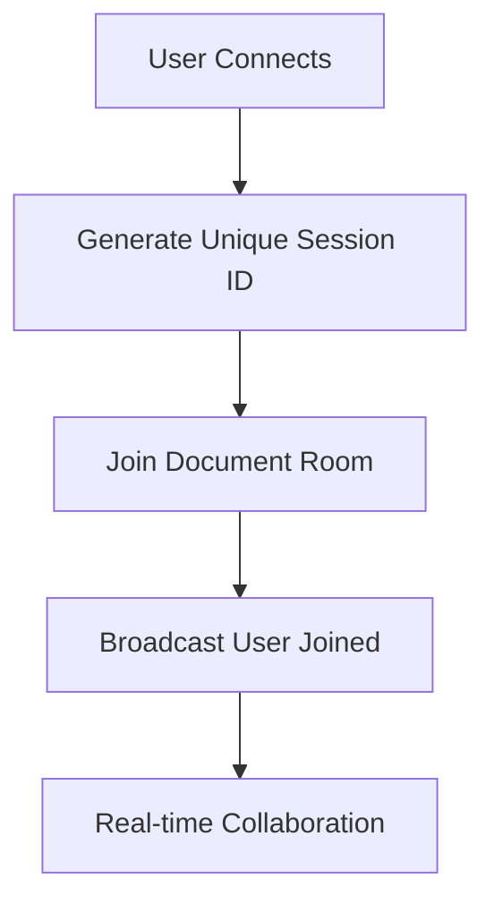
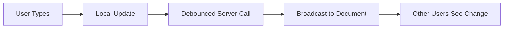

# 📊 Collaborative Spreadsheet

A real-time collaborative spreadsheet application built with modern web technologies. Multiple users can simultaneously edit spreadsheets with live updates, visual editing indicators, and seamless synchronization.

## 🚀 Live Demo

**Frontend**: [https://spreadsheet-fe.vercel.app/](https://spreadsheet-fe.vercel.app/)

## ✨ Features

### 🔥 Real-Time Collaboration
- **Live Cell Editing**: See other users editing cells in real-time with colored indicators
- **Instant Updates**: Changes appear immediately across all connected users
- **User Avatars**: Visual representation of all active users with colored circles
- **Edit Conflicts Prevention**: Visual feedback when multiple users edit the same cell

### 🏗️ Document-Based Architecture
- **Individual User Sessions**: Each user gets a unique session ID for personalized experience
- **Shared Document Collaboration**: All users collaborate on the same document while maintaining separate sessions

### 📱 Mobile Responsive Design
- **Adaptive Header**: Desktop shows full info, mobile uses hamburger menu
- **Touch-Optimized**: Large tap targets and touch-friendly interactions
- **Slide-Out Menu**: Beautiful mobile navigation with comprehensive info

### ⚡ Performance Optimizations
- **Smart Debouncing**: 
  - Cell value changes: 300ms delay to reduce server calls
  - Edit start events: 150ms delay to prevent rapid focus/blur
  - Edit end events: 100ms delay with smart cancellation
- **Optimized Updates**: Prevents unnecessary re-renders and API calls
- **Local-First UI**: Immediate local updates with server synchronization

### 👤 Enhanced User Experience
- **Clear Current User Identification**: 
  - Desktop: Current user appears rightmost with "(You)" label
  - Mobile: Clear "YOU" badge in user list
- **Connection Status**:
  - Desktop: Full "Connected/Disconnected" with colored background
  - Mobile: Colored dot + "C"/"NC" abbreviation
- **Session Information**: Document ID, Session ID, and active user count
- **Smart Typography**: Proper visual hierarchy and readable fonts

### 🔧 Technical Features
- **WebSocket Communication**: Real-time bidirectional communication
- **Anti-Loop Protection**: Prevents self-updates to avoid character loss during typing
- **Memory Management**: Proper cleanup of timeouts and event listeners
- **Error Handling**: Graceful degradation and connection recovery
- **Cross-Origin Support**: CORS configured for multiple deployment environments

## 🛠️ Technology Stack

### Frontend
- **Framework**: Svelte with TypeScript
- **Styling**: Custom CSS with responsive design
- **Real-time**: Socket.IO Client
- **Build Tool**: Vite
- **Deployment**: Vercel

### Backend
- **Runtime**: Node.js with Express
- **Real-time**: Socket.IO Server
- **Data Storage**: In-memory (extensible to database)
- **Deployment**: Railway

## 📁 Project Structure

```
spreadsheet/
├── fe/                    # Frontend (Svelte)
│   ├── src/
│   │   ├── components/    # Reusable UI components
│   │   ├── services/      # Socket service and API layer
│   │   ├── types/         # TypeScript type definitions
│   │   └── App.svelte     # Main application component
│   └── package.json
├── be/                    # Backend (Node.js)
│   ├── src/
│   │   └── server.js      # Express server with Socket.IO
│   └── package.json
└── README.md
```

## 🚦 Getting Started

### Prerequisites
- Node.js (v16 or higher)
- npm or yarn

### Local Development

1. **Clone the repository**
   ```bash
   git clone https://github.com/ShivSoni5/spreadsheet.git
   cd spreadsheet
   ```

2. **Install dependencies**
   ```bash
   # Install root dependencies
   npm install
   
   # Install frontend dependencies
   cd fe
   npm install
   
   # Install backend dependencies
   cd ../be
   npm install
   ```

3. **Start the backend server**
   ```bash
   cd be
   npm run dev
   # Server runs on http://localhost:3001
   ```

4. **Start the frontend development server**
   ```bash
   cd fe
   npm run dev
   # Frontend runs on http://localhost:5173
   ```

5. **Open multiple browser tabs** to test real-time collaboration

### Environment Variables

#### Frontend (`fe/.env`)
```env
VITE_SERVER_URL=http://localhost:3001  # For local development
```

#### Backend (`be/.env`)
```env
NODE_ENV=development
PORT=3001
```

## 🎯 Usage

### Document Collaboration
- Each user automatically gets a unique session ID
- All users collaborate on the same document (default: "default-doc")
- Use URL parameters to specify documents: `?doc=my-spreadsheet`

### Real-Time Features
1. **Cell Editing**: Click any cell to start editing
2. **Live Indicators**: See colored borders when others are editing
3. **User Avatars**: View all connected users in the header
4. **Mobile Menu**: Tap hamburger menu for full user list and session info

### Keyboard Shortcuts
- **Tab**: Navigate to next cell
- **Enter**: Navigate to cell below
- **Escape**: Exit cell editing mode

## 📊 Architecture Overview

### Session Management


### Data Flow


## 🎬 Screenshots & Videos

### Desktop Interface
<!-- Add desktop screenshots here -->


### Mobile Interface
<!-- Add mobile screenshots here -->


## 🔮 Future Enhancements

- [ ] **Database Integration**: Persistent data storage with PostgreSQL/MongoDB
- [ ] **User Authentication**: Login system with user accounts
- [ ] **Formula Support**: Excel-like formulas and calculations
- [ ] **File Import/Export**: CSV, Excel file support
- [ ] **Advanced Formatting**: Cell styling, fonts, colors
- [ ] **Chart Integration**: Data visualization capabilities
- [ ] **Version History**: Track and restore previous versions
- [ ] **Permissions System**: Read/write access control
- [ ] **Offline Support**: PWA with offline editing capabilities

## 🤝 Contributing

1. Fork the repository
2. Create your feature branch (`git checkout -b feature/amazing-feature`)
3. Commit your changes (`git commit -m 'Add some amazing feature'`)
4. Push to the branch (`git push origin feature/amazing-feature`)
5. Open a Pull Request

## 🙏 Acknowledgments

- Built with ❤️ using modern web technologies
- Inspired by collaborative tools like Google Sheets
- Special thanks to the Svelte and Socket.IO communities

---

**Made by [Shiv Soni](https://github.com/ShivSoni5)** 🚀 